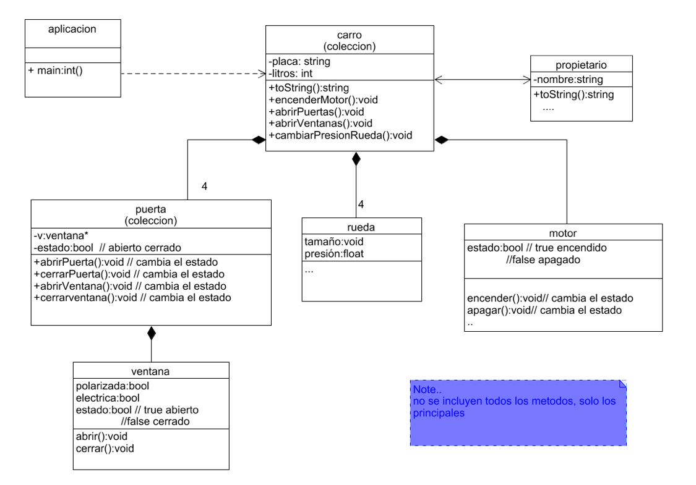

# Laboratorio #7 (Relaciones - Composición)

Se le presenta el diagrama a implementar, trabaje únicamente con memoria dinámica.

Observe que existe una relación bilateral entre propietario y carro. Además, carro posee una relación de composición con la clase motor, rueda y puerta. 

Recuerde que en composición cuando se destruye el todo se destruyen sus partes.

Desde la clase carro se debe poder:

- Encender el motor
- Abrir las puertas
- Abrir las ventanas de las puertas
- Cambiar la presión de las 4 ruedas
- Mostrar las principales características de todas sus partes y el nombre del propietario

 

Recuerde eliminar toda la memoria creada

